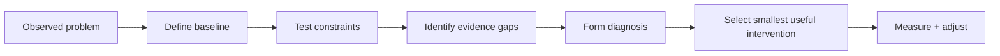

# Diagnose Before Intervention

## Problem

Teams often jump from a visible symptom directly to a preferred solution. That can produce activity without proving that the intervention addresses the real constraint.

## When to use it

Use this pattern when:

- several explanations could fit the same problem
- a proposed solution is expensive or difficult to reverse
- the available data is incomplete
- stakeholders are anchored to a target, tool, or tactic
- operational capacity may limit the value of added demand or automation

## Workflow

## Human role

A person decides which hypotheses are worth testing, whether the diagnosis matches operating reality, and what evidence is strong enough to justify action.

## Failure mode

The failure mode is allowing the desired tactic to become the diagnosis. For example, assuming the answer is more advertising, more staff, a new software platform, or more automation before establishing the bottleneck.

## Example

A growth target may suggest adding capacity, but the diagnostic first asks whether the current roster has usable headroom, whether repeat behavior is weak, whether conversion is actually measured, and whether demand is the limiting factor.

The output is not a list of ideas. It is a sequence from evidence to constraint to testable intervention.

## Evidence in the portfolio

This pattern appears most directly in:

- [Small Business Growth Diagnostic — Diagnostic Framework](https://github.com/dustinvaldezai/small-business-growth-diagnostic/blob/main/docs/diagnostic-framework.md)

It is reinforced by the staged design in:

- [Workflow Transformation](https://github.com/dustinvaldezai/workflow-transformation)
- [Community Operations Automation](https://github.com/dustinvaldezai/community-operations-automation)
