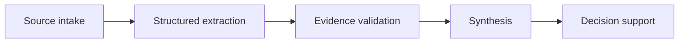

# Evidence Before Synthesis

## Problem

When extraction, interpretation, and recommendation happen in one step, unsupported claims can become difficult to detect. The final answer may sound coherent even when its evidence is weak.

## When to use it

Use this pattern when:

- conclusions depend on multiple sources or records
- source definitions matter
- recommendations could be distorted by missing context
- the team needs to trace claims back to evidence

## Workflow

## Human role

A person decides whether the evidence is sufficient, whether important qualifiers have been preserved, and whether the synthesis is proportionate to what the source material actually supports.

## Failure mode

The failure mode is asking AI to jump directly from raw material to a polished conclusion. That encourages the system to smooth over gaps, contradictions, and weak source coverage.

## Example

Before summarizing a set of research notes, extract the material claims into a structured form, identify where each claim came from, flag conflicts, and only then generate the synthesis.

In a business diagnostic, establish what the operating data actually represents before using it to define a baseline or recommend an intervention.

## Evidence in the portfolio

This pattern appears in:

- [Workflow Transformation — Verification Checklist](https://github.com/dustinvaldezai/workflow-transformation/blob/main/docs/verification-checklist.md)
- [Small Business Growth Diagnostic — Diagnostic Framework](https://github.com/dustinvaldezai/small-business-growth-diagnostic/blob/main/docs/diagnostic-framework.md)
