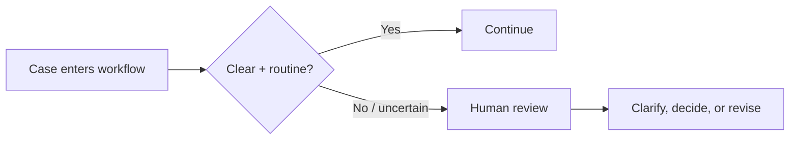

# Fail Toward Review

## Problem

Automation becomes risky when the system feels pressure to produce an answer even when classification is weak, information is missing, or the case falls outside the routine path.

## When to use it

Use this pattern when:

- ambiguity has meaningful consequences
- a request does not match an established category
- available information conflicts
- the workflow could create a commitment or affect another person
- the system cannot explain why a case belongs in the automated path

## Workflow

## Human role

A person resolves ambiguity, requests missing information, or decides whether the case can safely re-enter the routine workflow.

## Failure mode

The failure mode is optimizing for completion rate instead of decision quality. Forcing every case through automation creates confident errors precisely where judgment is most needed.

## Example

If an incoming request is a standard question with established information, it can follow the routine path. If it involves an exception, complaint, sensitive issue, conflicting facts, or unclear category, the workflow stops and routes to review.

In research or analysis, the equivalent move is returning to evidence validation when a material claim cannot be traced or when sources conflict.

## Evidence in the portfolio

This pattern appears in:

- [Community Operations Automation — Decision Rules](https://github.com/dustinvaldezai/community-operations-automation/blob/main/docs/decision-rules.md)
- [Workflow Transformation — Verification Checklist](https://github.com/dustinvaldezai/workflow-transformation/blob/main/docs/verification-checklist.md)
- [Small Business Growth Diagnostic — Assumptions and Limitations](https://github.com/dustinvaldezai/small-business-growth-diagnostic/blob/main/docs/assumptions-and-limitations.md)
