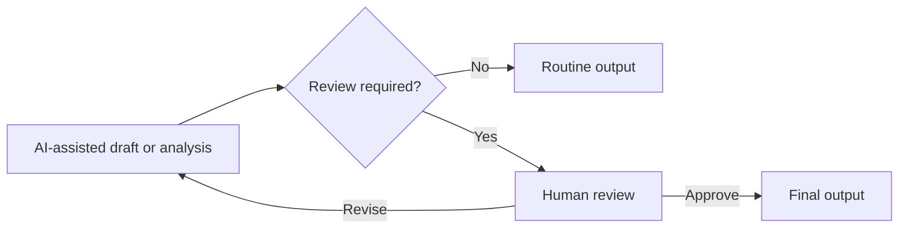

# Human Review Gate

## Problem

AI can prepare useful work quickly, but speed does not remove the need for judgment. Some outputs create commitments, influence decisions, or depend on context the system cannot safely resolve on its own.

## When to use it

Use a human review gate when:

- a decision has meaningful operational consequences
- a response could create a promise, exception, deadline, or policy interpretation
- evidence is incomplete or contradictory
- a recommendation depends on business context
- tone, fairness, privacy, safety, or access requires judgment

## Workflow

## Human role

The reviewer checks whether the output is accurate, proportionate to the evidence, appropriate for the context, and safe to act on.

The person owns the final judgment. AI prepares the work.

## Failure mode

A weak implementation treats human review as a cosmetic final glance after the system has already made the important decision.

A stronger implementation makes review an explicit decision point with the ability to revise, reject, or request more information.

## Example

An operational message can be drafted automatically when it uses established information. If it involves an exception, complaint, sensitive circumstance, or new commitment, the workflow stops for a person to review it before anything is sent.

## Evidence in the portfolio

This pattern appears in:

- [Workflow Transformation — Verification Checklist](https://github.com/dustinvaldezai/workflow-transformation/blob/main/docs/verification-checklist.md)
- [Community Operations Automation — Human Review Checklist](https://github.com/dustinvaldezai/community-operations-automation/blob/main/docs/human-review-checklist.md)
- [Small Business Growth Diagnostic — Assumptions and Limitations](https://github.com/dustinvaldezai/small-business-growth-diagnostic/blob/main/docs/assumptions-and-limitations.md)
