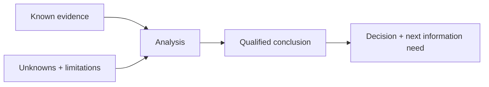

# Keep Unknowns Visible

## Problem

AI systems often make incomplete information sound more complete than it is. In operational work, that can turn a useful uncertainty into a false conclusion.

## When to use it

Use this pattern when:

- data is incomplete or directional
- a metric is a proxy rather than a perfect measure
- scenarios are modeled rather than observed
- source records have known gaps
- two pieces of evidence conflict

## Workflow

## Human role

The reviewer decides whether the remaining uncertainty is acceptable for the decision at hand and whether more information is needed before proceeding.

## Failure mode

The failure mode is silently converting a proxy, estimate, possibility, or missing field into a confident fact.

## Example

If accepted appointments are the available operating measure but not verified completed services, keep that distinction visible in the analysis. If capacity is scenario-based, present it as a range for feasibility rather than a forecast.

## Evidence in the portfolio

This pattern appears in:

- [Workflow Transformation — Verification Checklist](https://github.com/dustinvaldezai/workflow-transformation/blob/main/docs/verification-checklist.md)
- [Small Business Growth Diagnostic — Assumptions and Limitations](https://github.com/dustinvaldezai/small-business-growth-diagnostic/blob/main/docs/assumptions-and-limitations.md)
- [Community Operations Automation — Decision Rules](https://github.com/dustinvaldezai/community-operations-automation/blob/main/docs/decision-rules.md)
